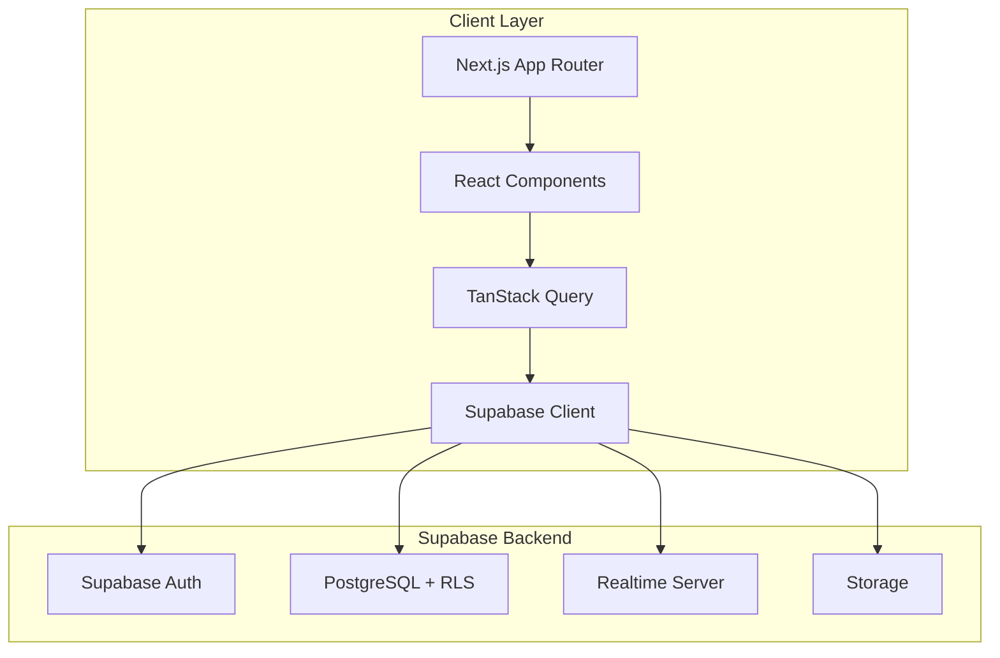

# Design Document

## Overview

本設計書は、Next.js 15 (App Router) + Supabaseを使用したエンタープライズグレードのリアルタイムチャットアプリケーションの技術設計を定義します。本システムは、Slack/Discordに匹敵する機能性を持ちながら、セキュリティ（RLS）、パフォーマンス（楽観的更新）、保守性（テスト、型安全性）を重視した実務品質のコードベースを実現します。

### 技術スタック

- **Frontend Framework**: Next.js 15 (App Router)
- **Language**: TypeScript 5.x (strict mode)
- **Styling**: Tailwind CSS 3.x
- **UI Components**: Shadcn/ui (Radix UI based)
- **State Management**: TanStack Query v5 (React Query)
- **Form Handling**: React Hook Form + Zod
- **Backend/Database**: Supabase (PostgreSQL 15)
- **Authentication**: Supabase Auth
- **Realtime**: Supabase Realtime
- **Storage**: Supabase Storage
- **Testing**: Vitest (unit), Playwright (E2E)
- **Code Quality**: ESLint, Prettier, Husky

## Architecture

### High-Level Architecture




### Application Structure

```
src/
├── app/                          # Next.js App Router
│   ├── (auth)/                   # Auth route group
│   │   ├── login/
│   │   └── signup/
│   ├── (chat)/                   # Main chat route group
│   │   ├── channels/[id]/
│   │   ├── dm/[id]/
│   │   └── layout.tsx            # Chat layout with sidebar
│   ├── api/                      # API routes (if needed)
│   ├── layout.tsx                # Root layout
│   └── page.tsx                  # Landing page
├── components/
│   ├── ui/                       # Shadcn/ui components
│   ├── chat/                     # Chat-specific components
│   │   ├── MessageList.tsx
│   │   ├── MessageInput.tsx
│   │   ├── ChannelSidebar.tsx
│   │   └── TypingIndicator.tsx
│   ├── auth/                     # Auth components
│   └── shared/                   # Shared components
├── lib/
│   ├── supabase/                 # Supabase client & utilities
│   │   ├── client.ts
│   │   ├── server.ts
│   │   └── middleware.ts
│   ├── hooks/                    # Custom React hooks
│   │   ├── useMessages.ts
│   │   ├── useChannels.ts
│   │   ├── usePresence.ts
│   │   └── useTypingIndicator.ts
│   ├── queries/                  # TanStack Query hooks
│   ├── validations/              # Zod schemas
│   └── utils/                    # Utility functions
├── types/
│   ├── database.types.ts         # Generated from Supabase
│   └── index.ts                  # Custom types
└── tests/
    ├── unit/
    └── e2e/
```

### Layer Responsibilities

1. **App Router Layer**: Routing, layouts, server components
2. **Component Layer**: UI presentation, user interactions
3. **Hook Layer**: Business logic, state management
4. **Query Layer**: Data fetching, caching, optimistic updates
5. **Supabase Layer**: Database access, auth, realtime subscriptions

## Components and Interfaces

### Core Components

#### 1. Authentication Components

**LoginForm**
- Purpose: Handle user login with email/password or OAuth
- Props: `onSuccess?: () => void`
- State: Form state (React Hook Form), loading state
- Validation: Zod schema for email/password

**SignupForm**
- Purpose: Handle user registration
- Props: `onSuccess?: () => void`
- State: Form state, loading state
- Validation: Zod schema with password strength requirements

**OAuthButtons**
- Purpose: Render GitHub and Google OAuth buttons
- Props: `provider: 'github' | 'google'`, `onSuccess?: () => void`
- Behavior: Trigger Supabase OAuth flow

#### 2. Chat Components

**ChannelSidebar**
- Purpose: Display list of channels and DMs
- Props: `currentChannelId?: string`
- State: Selected channel, search query
- Data: Channels list, DMs list, online users (via TanStack Query)
- Realtime: Subscribe to new channels, presence updates

**MessageList**
- Purpose: Display messages with infinite scroll
- Props: `channelId: string`, `type: 'channel' | 'dm'`
- State: Messages array, loading state, has more
- Data: Paginated messages (via TanStack Query)
- Realtime: Subscribe to new messages, edits, deletions
- Features: Virtual scrolling, optimistic updates, read receipts

**MessageInput**
- Purpose: Compose and send messages
- Props: `channelId: string`, `type: 'channel' | 'dm'`
- State: Input value, uploading files, typing indicator
- Features: File upload (drag & drop), emoji picker, send on Enter
- Optimistic: Immediately add message to UI before server confirmation

**MessageItem**
- Purpose: Render individual message
- Props: `message: Message`, `onEdit?: () => void`, `onDelete?: () => void`
- Features: Display text, images, files, read receipts, edit/delete actions
- Conditional: Show edit/delete only for own messages

**TypingIndicator**
- Purpose: Show who is typing
- Props: `channelId: string`
- State: Array of typing users
- Realtime: Subscribe to typing events via Presence

**ChannelHeader**
- Purpose: Display channel info and actions
- Props: `channel: Channel`
- Features: Channel name, description, member count, settings button

#### 3. Profile Components

**ProfileEditor**
- Purpose: Edit user profile
- Props: `userId: string`
- State: Form state, avatar upload progress
- Features: Display name, bio, avatar upload to Supabase Storage
- Validation: Zod schema for profile fields

**AvatarUpload**
- Purpose: Handle avatar image upload
- Props: `currentAvatar?: string`, `onUpload: (url: string) => void`
- Features: Preview, drag & drop, file validation (type, size)
- Storage: Upload to Supabase Storage bucket

### Custom Hooks

#### useMessages
```typescript
interface UseMessagesOptions {
  channelId: string;
  type: 'channel' | 'dm';
  pageSize?: number;
}

interface UseMessagesReturn {
  messages: Message[];
  isLoading: boolean;
  error: Error | null;
  hasMore: boolean;
  fetchMore: () => void;
  sendMessage: (content: string, attachments?: File[]) => Promise<void>;
  editMessage: (messageId: string, content: string) => Promise<void>;
  deleteMessage: (messageId: string) => Promise<void>;
}

function useMessages(options: UseMessagesOptions): UseMessagesReturn
```

Purpose: Manage message fetching, sending, editing, deleting with optimistic updates


#### useChannels
```typescript
interface UseChannelsReturn {
  channels: Channel[];
  isLoading: boolean;
  error: Error | null;
  createChannel: (name: string, description?: string) => Promise<Channel>;
  joinChannel: (channelId: string) => Promise<void>;
  leaveChannel: (channelId: string) => Promise<void>;
}

function useChannels(): UseChannelsReturn
```

Purpose: Manage channel operations with optimistic updates

#### usePresence
```typescript
interface UsePresenceOptions {
  channelId?: string;
}

interface UsePresenceReturn {
  onlineUsers: User[];
  isUserOnline: (userId: string) => boolean;
}

function usePresence(options?: UsePresenceOptions): UsePresenceReturn
```

Purpose: Track online/offline status using Supabase Presence

#### useTypingIndicator
```typescript
interface UseTypingIndicatorOptions {
  channelId: string;
  userId: string;
}

interface UseTypingIndicatorReturn {
  typingUsers: User[];
  startTyping: () => void;
  stopTyping: () => void;
}

function useTypingIndicator(options: UseTypingIndicatorOptions): UseTypingIndicatorReturn
```

Purpose: Manage typing indicator state with Supabase broadcast

#### useReadReceipts
```typescript
interface UseReadReceiptsOptions {
  messageId: string;
}

interface UseReadReceiptsReturn {
  receipts: ReadReceipt[];
  markAsRead: () => Promise<void>;
}

function useReadReceipts(options: UseReadReceiptsOptions): UseReadReceiptsReturn
```

Purpose: Track and display message read receipts

## Data Models

### Database Schema

#### users
```sql
CREATE TABLE users (
  id UUID PRIMARY KEY REFERENCES auth.users(id) ON DELETE CASCADE,
  email TEXT NOT NULL UNIQUE,
  display_name TEXT NOT NULL,
  avatar_url TEXT,
  bio TEXT,
  created_at TIMESTAMPTZ NOT NULL DEFAULT NOW(),
  updated_at TIMESTAMPTZ NOT NULL DEFAULT NOW()
);

-- RLS Policies
ALTER TABLE users ENABLE ROW LEVEL SECURITY;

CREATE POLICY "Users can view all profiles"
  ON users FOR SELECT
  USING (true);

CREATE POLICY "Users can update own profile"
  ON users FOR UPDATE
  USING (auth.uid() = id);
```

#### channels
```sql
CREATE TABLE channels (
  id UUID PRIMARY KEY DEFAULT gen_random_uuid(),
  name TEXT NOT NULL UNIQUE,
  description TEXT,
  created_by UUID NOT NULL REFERENCES users(id) ON DELETE CASCADE,
  created_at TIMESTAMPTZ NOT NULL DEFAULT NOW(),
  updated_at TIMESTAMPTZ NOT NULL DEFAULT NOW()
);

-- RLS Policies
ALTER TABLE channels ENABLE ROW LEVEL SECURITY;

CREATE POLICY "Users can view channels they are members of"
  ON channels FOR SELECT
  USING (
    EXISTS (
      SELECT 1 FROM channel_members
      WHERE channel_members.channel_id = channels.id
      AND channel_members.user_id = auth.uid()
    )
  );

CREATE POLICY "Authenticated users can create channels"
  ON channels FOR INSERT
  WITH CHECK (auth.uid() = created_by);
```

#### channel_members
```sql
CREATE TABLE channel_members (
  id UUID PRIMARY KEY DEFAULT gen_random_uuid(),
  channel_id UUID NOT NULL REFERENCES channels(id) ON DELETE CASCADE,
  user_id UUID NOT NULL REFERENCES users(id) ON DELETE CASCADE,
  joined_at TIMESTAMPTZ NOT NULL DEFAULT NOW(),
  UNIQUE(channel_id, user_id)
);

-- RLS Policies
ALTER TABLE channel_members ENABLE ROW LEVEL SECURITY;

CREATE POLICY "Users can view members of their channels"
  ON channel_members FOR SELECT
  USING (
    EXISTS (
      SELECT 1 FROM channel_members cm
      WHERE cm.channel_id = channel_members.channel_id
      AND cm.user_id = auth.uid()
    )
  );

CREATE POLICY "Users can join channels"
  ON channel_members FOR INSERT
  WITH CHECK (auth.uid() = user_id);

CREATE POLICY "Users can leave channels"
  ON channel_members FOR DELETE
  USING (auth.uid() = user_id);
```

#### direct_messages
```sql
CREATE TABLE direct_messages (
  id UUID PRIMARY KEY DEFAULT gen_random_uuid(),
  user1_id UUID NOT NULL REFERENCES users(id) ON DELETE CASCADE,
  user2_id UUID NOT NULL REFERENCES users(id) ON DELETE CASCADE,
  created_at TIMESTAMPTZ NOT NULL DEFAULT NOW(),
  UNIQUE(user1_id, user2_id),
  CHECK (user1_id < user2_id) -- Ensure consistent ordering
);

-- RLS Policies
ALTER TABLE direct_messages ENABLE ROW LEVEL SECURITY;

CREATE POLICY "Users can view their own DMs"
  ON direct_messages FOR SELECT
  USING (auth.uid() IN (user1_id, user2_id));

CREATE POLICY "Users can create DMs"
  ON direct_messages FOR INSERT
  WITH CHECK (auth.uid() IN (user1_id, user2_id));
```

#### messages
```sql
CREATE TABLE messages (
  id UUID PRIMARY KEY DEFAULT gen_random_uuid(),
  content TEXT NOT NULL,
  user_id UUID NOT NULL REFERENCES users(id) ON DELETE CASCADE,
  channel_id UUID REFERENCES channels(id) ON DELETE CASCADE,
  dm_id UUID REFERENCES direct_messages(id) ON DELETE CASCADE,
  created_at TIMESTAMPTZ NOT NULL DEFAULT NOW(),
  updated_at TIMESTAMPTZ NOT NULL DEFAULT NOW(),
  is_deleted BOOLEAN NOT NULL DEFAULT false,
  CHECK (
    (channel_id IS NOT NULL AND dm_id IS NULL) OR
    (channel_id IS NULL AND dm_id IS NOT NULL)
  )
);

CREATE INDEX idx_messages_channel_id ON messages(channel_id, created_at DESC);
CREATE INDEX idx_messages_dm_id ON messages(dm_id, created_at DESC);

-- RLS Policies
ALTER TABLE messages ENABLE ROW LEVEL SECURITY;

CREATE POLICY "Users can view messages in their channels"
  ON messages FOR SELECT
  USING (
    (channel_id IS NOT NULL AND EXISTS (
      SELECT 1 FROM channel_members
      WHERE channel_members.channel_id = messages.channel_id
      AND channel_members.user_id = auth.uid()
    )) OR
    (dm_id IS NOT NULL AND EXISTS (
      SELECT 1 FROM direct_messages
      WHERE direct_messages.id = messages.dm_id
      AND auth.uid() IN (direct_messages.user1_id, direct_messages.user2_id)
    ))
  );

CREATE POLICY "Users can insert messages in their channels/DMs"
  ON messages FOR INSERT
  WITH CHECK (
    auth.uid() = user_id AND (
      (channel_id IS NOT NULL AND EXISTS (
        SELECT 1 FROM channel_members
        WHERE channel_members.channel_id = messages.channel_id
        AND channel_members.user_id = auth.uid()
      )) OR
      (dm_id IS NOT NULL AND EXISTS (
        SELECT 1 FROM direct_messages
        WHERE direct_messages.id = messages.dm_id
        AND auth.uid() IN (direct_messages.user1_id, direct_messages.user2_id)
      ))
    )
  );

CREATE POLICY "Users can update their own messages"
  ON messages FOR UPDATE
  USING (auth.uid() = user_id)
  WITH CHECK (auth.uid() = user_id);

CREATE POLICY "Users can delete their own messages"
  ON messages FOR DELETE
  USING (auth.uid() = user_id);
```


#### message_attachments
```sql
CREATE TABLE message_attachments (
  id UUID PRIMARY KEY DEFAULT gen_random_uuid(),
  message_id UUID NOT NULL REFERENCES messages(id) ON DELETE CASCADE,
  file_name TEXT NOT NULL,
  file_type TEXT NOT NULL,
  file_size INTEGER NOT NULL,
  storage_path TEXT NOT NULL,
  created_at TIMESTAMPTZ NOT NULL DEFAULT NOW()
);

-- RLS Policies
ALTER TABLE message_attachments ENABLE ROW LEVEL SECURITY;

CREATE POLICY "Users can view attachments of messages they can see"
  ON message_attachments FOR SELECT
  USING (
    EXISTS (
      SELECT 1 FROM messages
      WHERE messages.id = message_attachments.message_id
      AND (
        (messages.channel_id IS NOT NULL AND EXISTS (
          SELECT 1 FROM channel_members
          WHERE channel_members.channel_id = messages.channel_id
          AND channel_members.user_id = auth.uid()
        )) OR
        (messages.dm_id IS NOT NULL AND EXISTS (
          SELECT 1 FROM direct_messages
          WHERE direct_messages.id = messages.dm_id
          AND auth.uid() IN (direct_messages.user1_id, direct_messages.user2_id)
        ))
      )
    )
  );

CREATE POLICY "Users can insert attachments for their messages"
  ON message_attachments FOR INSERT
  WITH CHECK (
    EXISTS (
      SELECT 1 FROM messages
      WHERE messages.id = message_attachments.message_id
      AND messages.user_id = auth.uid()
    )
  );
```

#### read_receipts
```sql
CREATE TABLE read_receipts (
  id UUID PRIMARY KEY DEFAULT gen_random_uuid(),
  message_id UUID NOT NULL REFERENCES messages(id) ON DELETE CASCADE,
  user_id UUID NOT NULL REFERENCES users(id) ON DELETE CASCADE,
  read_at TIMESTAMPTZ NOT NULL DEFAULT NOW(),
  UNIQUE(message_id, user_id)
);

CREATE INDEX idx_read_receipts_message_id ON read_receipts(message_id);

-- RLS Policies
ALTER TABLE read_receipts ENABLE ROW LEVEL SECURITY;

CREATE POLICY "Users can view read receipts for messages they can see"
  ON read_receipts FOR SELECT
  USING (
    EXISTS (
      SELECT 1 FROM messages
      WHERE messages.id = read_receipts.message_id
      AND (
        (messages.channel_id IS NOT NULL AND EXISTS (
          SELECT 1 FROM channel_members
          WHERE channel_members.channel_id = messages.channel_id
          AND channel_members.user_id = auth.uid()
        )) OR
        (messages.dm_id IS NOT NULL AND EXISTS (
          SELECT 1 FROM direct_messages
          WHERE direct_messages.id = messages.dm_id
          AND auth.uid() IN (direct_messages.user1_id, direct_messages.user2_id)
        ))
      )
    )
  );

CREATE POLICY "Users can create read receipts"
  ON read_receipts FOR INSERT
  WITH CHECK (auth.uid() = user_id);
```

### TypeScript Types

```typescript
// Generated from Supabase
export type Database = {
  public: {
    Tables: {
      users: {
        Row: {
          id: string;
          email: string;
          display_name: string;
          avatar_url: string | null;
          bio: string | null;
          created_at: string;
          updated_at: string;
        };
        Insert: Omit<Row, 'created_at' | 'updated_at'>;
        Update: Partial<Insert>;
      };
      // ... other tables
    };
  };
};

// Custom types
export interface Message {
  id: string;
  content: string;
  user_id: string;
  channel_id: string | null;
  dm_id: string | null;
  created_at: string;
  updated_at: string;
  is_deleted: boolean;
  user: User;
  attachments: MessageAttachment[];
  read_receipts: ReadReceipt[];
}

export interface Channel {
  id: string;
  name: string;
  description: string | null;
  created_by: string;
  created_at: string;
  updated_at: string;
  members: User[];
  unread_count?: number;
}

export interface DirectMessage {
  id: string;
  user1_id: string;
  user2_id: string;
  created_at: string;
  other_user: User;
  last_message?: Message;
  unread_count?: number;
}
```

### Zod Validation Schemas

```typescript
import { z } from 'zod';

export const loginSchema = z.object({
  email: z.string().email('Invalid email address'),
  password: z.string().min(8, 'Password must be at least 8 characters'),
});

export const signupSchema = z.object({
  email: z.string().email('Invalid email address'),
  password: z
    .string()
    .min(8, 'Password must be at least 8 characters')
    .regex(/[A-Z]/, 'Password must contain at least one uppercase letter')
    .regex(/[a-z]/, 'Password must contain at least one lowercase letter')
    .regex(/[0-9]/, 'Password must contain at least one number'),
  displayName: z
    .string()
    .min(2, 'Display name must be at least 2 characters')
    .max(50, 'Display name must be at most 50 characters'),
});

export const profileSchema = z.object({
  display_name: z
    .string()
    .min(2, 'Display name must be at least 2 characters')
    .max(50, 'Display name must be at most 50 characters'),
  bio: z.string().max(500, 'Bio must be at most 500 characters').optional(),
});

export const channelSchema = z.object({
  name: z
    .string()
    .min(3, 'Channel name must be at least 3 characters')
    .max(50, 'Channel name must be at most 50 characters')
    .regex(/^[a-z0-9-]+$/, 'Channel name must be lowercase alphanumeric with hyphens'),
  description: z.string().max(200, 'Description must be at most 200 characters').optional(),
});

export const messageSchema = z.object({
  content: z
    .string()
    .min(1, 'Message cannot be empty')
    .max(4000, 'Message must be at most 4000 characters'),
});

export const fileUploadSchema = z.object({
  file: z
    .instanceof(File)
    .refine((file) => file.size <= 10 * 1024 * 1024, 'File size must be less than 10MB')
    .refine(
      (file) =>
        [
          'image/jpeg',
          'image/png',
          'image/gif',
          'image/webp',
          'application/pdf',
          'application/vnd.openxmlformats-officedocument.wordprocessingml.document',
          'application/vnd.openxmlformats-officedocument.spreadsheetml.sheet',
          'text/plain',
        ].includes(file.type),
      'Invalid file type'
    ),
});
```

## Error Handling

### Error Types

```typescript
export class AuthenticationError extends Error {
  constructor(message: string) {
    super(message);
    this.name = 'AuthenticationError';
  }
}

export class AuthorizationError extends Error {
  constructor(message: string) {
    super(message);
    this.name = 'AuthorizationError';
  }
}

export class ValidationError extends Error {
  constructor(message: string, public field?: string) {
    super(message);
    this.name = 'ValidationError';
  }
}

export class NetworkError extends Error {
  constructor(message: string) {
    super(message);
    this.name = 'NetworkError';
  }
}
```


### Error Handling Strategy

1. **Client-Side Validation**: Use Zod schemas with React Hook Form to catch validation errors before submission
2. **API Error Handling**: Wrap Supabase calls in try-catch blocks and transform errors into user-friendly messages
3. **Toast Notifications**: Display error messages using toast notifications (via Shadcn/ui toast component)
4. **Error Boundaries**: Implement React Error Boundaries for component-level error handling
5. **Retry Logic**: Use TanStack Query's automatic retry for transient network errors
6. **Fallback UI**: Display fallback UI when data fetching fails

### Error Handling Example

```typescript
// In a custom hook
export function useMessages({ channelId, type }: UseMessagesOptions) {
  const queryClient = useQueryClient();

  const sendMessageMutation = useMutation({
    mutationFn: async ({ content, attachments }: SendMessageInput) => {
      // Validate input
      messageSchema.parse({ content });

      // Upload attachments first
      const uploadedFiles = await uploadAttachments(attachments);

      // Insert message
      const { data, error } = await supabase
        .from('messages')
        .insert({
          content,
          user_id: userId,
          channel_id: type === 'channel' ? channelId : null,
          dm_id: type === 'dm' ? channelId : null,
        })
        .select()
        .single();

      if (error) {
        throw new NetworkError('Failed to send message');
      }

      // Insert attachments
      if (uploadedFiles.length > 0) {
        await supabase.from('message_attachments').insert(
          uploadedFiles.map((file) => ({
            message_id: data.id,
            ...file,
          }))
        );
      }

      return data;
    },
    onMutate: async (variables) => {
      // Optimistic update
      const optimisticMessage = {
        id: `temp-${Date.now()}`,
        content: variables.content,
        user_id: userId,
        created_at: new Date().toISOString(),
        is_sending: true,
      };

      queryClient.setQueryData(['messages', channelId], (old: Message[]) => [
        ...old,
        optimisticMessage,
      ]);

      return { optimisticMessage };
    },
    onError: (error, variables, context) => {
      // Rollback optimistic update
      queryClient.setQueryData(['messages', channelId], (old: Message[]) =>
        old.filter((msg) => msg.id !== context?.optimisticMessage.id)
      );

      // Show error toast
      toast.error('Failed to send message. Please try again.');
    },
    onSuccess: (data, variables, context) => {
      // Replace optimistic message with real one
      queryClient.setQueryData(['messages', channelId], (old: Message[]) =>
        old.map((msg) => (msg.id === context?.optimisticMessage.id ? data : msg))
      );
    },
  });

  return { sendMessage: sendMessageMutation.mutate };
}
```

## Realtime Implementation

### Supabase Realtime Subscriptions

#### Message Subscription

```typescript
export function useRealtimeMessages(channelId: string, type: 'channel' | 'dm') {
  const queryClient = useQueryClient();

  useEffect(() => {
    const channel = supabase
      .channel(`messages:${channelId}`)
      .on(
        'postgres_changes',
        {
          event: 'INSERT',
          schema: 'public',
          table: 'messages',
          filter: type === 'channel' ? `channel_id=eq.${channelId}` : `dm_id=eq.${channelId}`,
        },
        (payload) => {
          queryClient.setQueryData(['messages', channelId], (old: Message[]) => [
            ...old,
            payload.new as Message,
          ]);
        }
      )
      .on(
        'postgres_changes',
        {
          event: 'UPDATE',
          schema: 'public',
          table: 'messages',
          filter: type === 'channel' ? `channel_id=eq.${channelId}` : `dm_id=eq.${channelId}`,
        },
        (payload) => {
          queryClient.setQueryData(['messages', channelId], (old: Message[]) =>
            old.map((msg) => (msg.id === payload.new.id ? (payload.new as Message) : msg))
          );
        }
      )
      .on(
        'postgres_changes',
        {
          event: 'DELETE',
          schema: 'public',
          table: 'messages',
          filter: type === 'channel' ? `channel_id=eq.${channelId}` : `dm_id=eq.${channelId}`,
        },
        (payload) => {
          queryClient.setQueryData(['messages', channelId], (old: Message[]) =>
            old.filter((msg) => msg.id !== payload.old.id)
          );
        }
      )
      .subscribe();

    return () => {
      supabase.removeChannel(channel);
    };
  }, [channelId, type, queryClient]);
}
```

#### Presence Implementation

```typescript
export function usePresence(channelId?: string) {
  const [onlineUsers, setOnlineUsers] = useState<User[]>([]);
  const { user } = useAuth();

  useEffect(() => {
    if (!user) return;

    const channelName = channelId ? `presence:${channelId}` : 'presence:global';
    const channel = supabase.channel(channelName, {
      config: {
        presence: {
          key: user.id,
        },
      },
    });

    channel
      .on('presence', { event: 'sync' }, () => {
        const state = channel.presenceState();
        const users = Object.values(state).flat() as User[];
        setOnlineUsers(users);
      })
      .subscribe(async (status) => {
        if (status === 'SUBSCRIBED') {
          await channel.track({
            user_id: user.id,
            online_at: new Date().toISOString(),
          });
        }
      });

    return () => {
      supabase.removeChannel(channel);
    };
  }, [channelId, user]);

  return { onlineUsers, isUserOnline: (userId: string) => onlineUsers.some((u) => u.id === userId) };
}
```

#### Typing Indicator Implementation

```typescript
export function useTypingIndicator(channelId: string, userId: string) {
  const [typingUsers, setTypingUsers] = useState<User[]>([]);
  const typingTimeoutRef = useRef<NodeJS.Timeout>();

  useEffect(() => {
    const channel = supabase.channel(`typing:${channelId}`);

    channel
      .on('broadcast', { event: 'typing' }, (payload) => {
        if (payload.payload.user_id === userId) return;

        setTypingUsers((prev) => {
          const exists = prev.some((u) => u.id === payload.payload.user_id);
          if (!exists) {
            return [...prev, payload.payload.user];
          }
          return prev;
        });

        // Remove typing indicator after 3 seconds
        setTimeout(() => {
          setTypingUsers((prev) => prev.filter((u) => u.id !== payload.payload.user_id));
        }, 3000);
      })
      .subscribe();

    return () => {
      supabase.removeChannel(channel);
    };
  }, [channelId, userId]);

  const startTyping = useCallback(() => {
    const channel = supabase.channel(`typing:${channelId}`);
    channel.send({
      type: 'broadcast',
      event: 'typing',
      payload: { user_id: userId },
    });

    // Clear existing timeout
    if (typingTimeoutRef.current) {
      clearTimeout(typingTimeoutRef.current);
    }

    // Auto-stop typing after 3 seconds
    typingTimeoutRef.current = setTimeout(() => {
      stopTyping();
    }, 3000);
  }, [channelId, userId]);

  const stopTyping = useCallback(() => {
    if (typingTimeoutRef.current) {
      clearTimeout(typingTimeoutRef.current);
    }
  }, []);

  return { typingUsers, startTyping, stopTyping };
}
```

## Performance Optimization

### TanStack Query Configuration

```typescript
export const queryClient = new QueryClient({
  defaultOptions: {
    queries: {
      staleTime: 1000 * 60 * 5, // 5 minutes
      cacheTime: 1000 * 60 * 30, // 30 minutes
      refetchOnWindowFocus: false,
      retry: 3,
      retryDelay: (attemptIndex) => Math.min(1000 * 2 ** attemptIndex, 30000),
    },
    mutations: {
      retry: 1,
    },
  },
});
```


### Optimistic Updates Strategy

1. **Message Sending**: Immediately add message to UI with temporary ID
2. **Message Editing**: Update message content in cache before server confirmation
3. **Message Deletion**: Remove message from UI immediately
4. **Channel Creation**: Add channel to sidebar before server confirmation
5. **Rollback**: Revert optimistic updates if server request fails

### Virtual Scrolling

Use `@tanstack/react-virtual` for efficient rendering of large message lists:

```typescript
import { useVirtualizer } from '@tanstack/react-virtual';

export function MessageList({ messages }: { messages: Message[] }) {
  const parentRef = useRef<HTMLDivElement>(null);

  const virtualizer = useVirtualizer({
    count: messages.length,
    getScrollElement: () => parentRef.current,
    estimateSize: () => 80, // Estimated message height
    overscan: 5,
  });

  return (
    <div ref={parentRef} className="h-full overflow-auto">
      <div
        style={{
          height: `${virtualizer.getTotalSize()}px`,
          width: '100%',
          position: 'relative',
        }}
      >
        {virtualizer.getVirtualItems().map((virtualItem) => (
          <div
            key={virtualItem.key}
            style={{
              position: 'absolute',
              top: 0,
              left: 0,
              width: '100%',
              transform: `translateY(${virtualItem.start}px)`,
            }}
          >
            <MessageItem message={messages[virtualItem.index]} />
          </div>
        ))}
      </div>
    </div>
  );
}
```

### Image Lazy Loading

```typescript
export function MessageImage({ src, alt }: { src: string; alt: string }) {
  return (
     {
        e.currentTarget.src = '/placeholder-image.png';
      }}
    />
  );
}
```

### Prefetching

```typescript
export function ChannelListItem({ channel }: { channel: Channel }) {
  const queryClient = useQueryClient();

  const handleMouseEnter = () => {
    // Prefetch channel messages
    queryClient.prefetchQuery({
      queryKey: ['messages', channel.id],
      queryFn: () => fetchMessages(channel.id),
    });
  };

  return (
    <div onMouseEnter={handleMouseEnter}>
      {/* Channel item UI */}
    </div>
  );
}
```

## Storage Configuration

### Supabase Storage Buckets

#### avatars bucket
```sql
-- Create bucket
INSERT INTO storage.buckets (id, name, public)
VALUES ('avatars', 'avatars', true);

-- RLS Policies
CREATE POLICY "Avatar images are publicly accessible"
  ON storage.objects FOR SELECT
  USING (bucket_id = 'avatars');

CREATE POLICY "Users can upload their own avatar"
  ON storage.objects FOR INSERT
  WITH CHECK (
    bucket_id = 'avatars' AND
    auth.uid()::text = (storage.foldername(name))[1]
  );

CREATE POLICY "Users can update their own avatar"
  ON storage.objects FOR UPDATE
  USING (
    bucket_id = 'avatars' AND
    auth.uid()::text = (storage.foldername(name))[1]
  );

CREATE POLICY "Users can delete their own avatar"
  ON storage.objects FOR DELETE
  USING (
    bucket_id = 'avatars' AND
    auth.uid()::text = (storage.foldername(name))[1]
  );
```

#### message-attachments bucket
```sql
-- Create bucket
INSERT INTO storage.buckets (id, name, public)
VALUES ('message-attachments', 'message-attachments', false);

-- RLS Policies
CREATE POLICY "Users can view attachments in their channels/DMs"
  ON storage.objects FOR SELECT
  USING (
    bucket_id = 'message-attachments' AND
    EXISTS (
      SELECT 1 FROM message_attachments ma
      JOIN messages m ON m.id = ma.message_id
      WHERE ma.storage_path = name
      AND (
        (m.channel_id IS NOT NULL AND EXISTS (
          SELECT 1 FROM channel_members
          WHERE channel_members.channel_id = m.channel_id
          AND channel_members.user_id = auth.uid()
        )) OR
        (m.dm_id IS NOT NULL AND EXISTS (
          SELECT 1 FROM direct_messages
          WHERE direct_messages.id = m.dm_id
          AND auth.uid() IN (direct_messages.user1_id, direct_messages.user2_id)
        ))
      )
    )
  );

CREATE POLICY "Users can upload attachments"
  ON storage.objects FOR INSERT
  WITH CHECK (bucket_id = 'message-attachments');
```

### File Upload Utility

```typescript
export async function uploadFile(
  file: File,
  bucket: 'avatars' | 'message-attachments',
  userId: string
): Promise<string> {
  // Validate file
  fileUploadSchema.parse({ file });

  // Generate unique filename
  const fileExt = file.name.split('.').pop();
  const fileName = `${userId}/${Date.now()}.${fileExt}`;

  // Upload to Supabase Storage
  const { data, error } = await supabase.storage.from(bucket).upload(fileName, file, {
    cacheControl: '3600',
    upsert: false,
  });

  if (error) {
    throw new Error(`Failed to upload file: ${error.message}`);
  }

  // Get public URL
  const {
    data: { publicUrl },
  } = supabase.storage.from(bucket).getPublicUrl(data.path);

  return publicUrl;
}
```

## Testing Strategy

### Unit Testing

**Test Coverage Requirements:**
- All custom hooks: 100%
- All utility functions: 100%
- All Zod schemas: 100%
- React components: 80%

**Example Hook Test:**

```typescript
import { renderHook, waitFor } from '@testing-library/react';
import { describe, it, expect, vi } from 'vitest';
import { useMessages } from '@/lib/hooks/useMessages';

describe('useMessages', () => {
  it('should fetch messages on mount', async () => {
    const { result } = renderHook(() =>
      useMessages({ channelId: 'test-channel', type: 'channel' })
    );

    await waitFor(() => {
      expect(result.current.isLoading).toBe(false);
    });

    expect(result.current.messages).toHaveLength(10);
  });

  it('should send message with optimistic update', async () => {
    const { result } = renderHook(() =>
      useMessages({ channelId: 'test-channel', type: 'channel' })
    );

    await result.current.sendMessage('Hello world');

    // Check optimistic update
    expect(result.current.messages).toContainEqual(
      expect.objectContaining({
        content: 'Hello world',
        is_sending: true,
      })
    );

    // Wait for server confirmation
    await waitFor(() => {
      expect(result.current.messages).toContainEqual(
        expect.objectContaining({
          content: 'Hello world',
          is_sending: false,
        })
      );
    });
  });
});
```

### E2E Testing

**Critical User Flows:**
1. User signup and login
2. Create channel and send message
3. Join existing channel
4. Send direct message
5. Upload and view image attachment
6. Edit and delete message
7. View read receipts

**Example E2E Test:**

```typescript
import { test, expect } from '@playwright/test';

test.describe('Chat functionality', () => {
  test.beforeEach(async ({ page }) => {
    // Login
    await page.goto('/login');
    await page.fill('input[name="email"]', 'test@example.com');
    await page.fill('input[name="password"]', 'password123');
    await page.click('button[type="submit"]');
    await page.waitForURL('/channels');
  });

  test('should send and receive messages', async ({ page, context }) => {
    // Create new channel
    await page.click('button:has-text("New Channel")');
    await page.fill('input[name="name"]', 'test-channel');
    await page.click('button:has-text("Create")');

    // Send message
    await page.fill('textarea[placeholder="Type a message"]', 'Hello from E2E test');
    await page.press('textarea[placeholder="Type a message"]', 'Enter');

    // Verify message appears
    await expect(page.locator('text=Hello from E2E test')).toBeVisible();

    // Open second browser context (simulate another user)
    const page2 = await context.newPage();
    await page2.goto('/login');
    await page2.fill('input[name="email"]', 'test2@example.com');
    await page2.fill('input[name="password"]', 'password123');
    await page2.click('button[type="submit"]');

    // Join channel
    await page2.click('text=test-channel');

    // Verify message is visible to second user
    await expect(page2.locator('text=Hello from E2E test')).toBeVisible();
  });
});
```

### Integration Testing

Test Supabase integration with local Supabase instance:

```typescript
import { describe, it, expect, beforeAll, afterAll } from 'vitest';
import { createClient } from '@supabase/supabase-js';

describe('Supabase Integration', () => {
  let supabase: ReturnType<typeof createClient>;

  beforeAll(() => {
    supabase = createClient(
      process.env.SUPABASE_URL!,
      process.env.SUPABASE_ANON_KEY!
    );
  });

  it('should enforce RLS on messages table', async () => {
    // Try to read messages without authentication
    const { data, error } = await supabase.from('messages').select('*');

    expect(error).toBeTruthy();
    expect(data).toBeNull();
  });

  it('should allow authenticated user to send message', async () => {
    // Sign in
    await supabase.auth.signInWithPassword({
      email: 'test@example.com',
      password: 'password123',
    });

    // Send message
    const { data, error } = await supabase
      .from('messages')
      .insert({
        content: 'Test message',
        channel_id: 'test-channel-id',
      })
      .select()
      .single();

    expect(error).toBeNull();
    expect(data).toBeTruthy();
    expect(data?.content).toBe('Test message');
  });
});
```

## Deployment and CI/CD

### Environment Variables

```env
# Supabase
NEXT_PUBLIC_SUPABASE_URL=https://your-project.supabase.co
NEXT_PUBLIC_SUPABASE_ANON_KEY=your-anon-key
SUPABASE_SERVICE_ROLE_KEY=your-service-role-key

# OAuth (optional, configured in Supabase dashboard)
# GitHub OAuth
# Google OAuth
```

### CI/CD Pipeline (GitHub Actions)

```yaml
name: CI/CD

on:
  push:
    branches: [main, develop]
  pull_request:
    branches: [main, develop]

jobs:
  test:
    runs-on: ubuntu-latest
    steps:
      - uses: actions/checkout@v3
      - uses: actions/setup-node@v3
        with:
          node-version: '18'
      - run: npm ci
      - run: npm run lint
      - run: npm run type-check
      - run: npm run test:unit
      - run: npx playwright install
      - run: npm run test:e2e

  deploy:
    needs: test
    if: github.ref == 'refs/heads/main'
    runs-on: ubuntu-latest
    steps:
      - uses: actions/checkout@v3
      - uses: actions/setup-node@v3
        with:
          node-version: '18'
      - run: npm ci
      - run: npm run build
      - uses: vercel/action@v1
        with:
          vercel-token: ${{ secrets.VERCEL_TOKEN }}
          vercel-org-id: ${{ secrets.VERCEL_ORG_ID }}
          vercel-project-id: ${{ secrets.VERCEL_PROJECT_ID }}
```

## Security Considerations

1. **Row Level Security**: All tables have RLS enabled with strict policies
2. **Input Validation**: All user input validated with Zod schemas
3. **XSS Prevention**: React automatically escapes content; use DOMPurify for rich text if needed
4. **CSRF Protection**: Next.js API routes use CSRF tokens
5. **Rate Limiting**: Implement rate limiting on Supabase Edge Functions if needed
6. **File Upload Security**: Validate file types and sizes; scan for malware if handling sensitive data
7. **Authentication**: Use Supabase Auth with secure session management
8. **HTTPS Only**: Enforce HTTPS in production
9. **Environment Variables**: Never expose service role key to client

## Monitoring and Observability

1. **Error Tracking**: Integrate Sentry for error monitoring
2. **Performance Monitoring**: Use Vercel Analytics or similar
3. **Database Monitoring**: Use Supabase dashboard for query performance
4. **Logging**: Implement structured logging for debugging
5. **Metrics**: Track key metrics (message send latency, user engagement, etc.)
